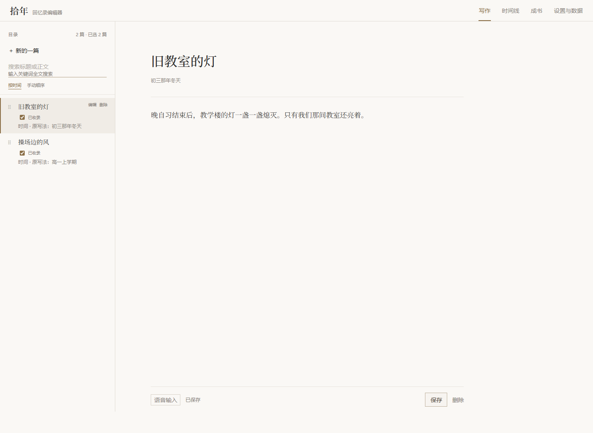
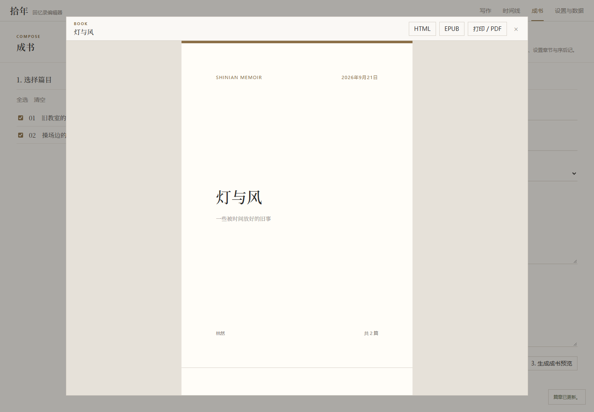
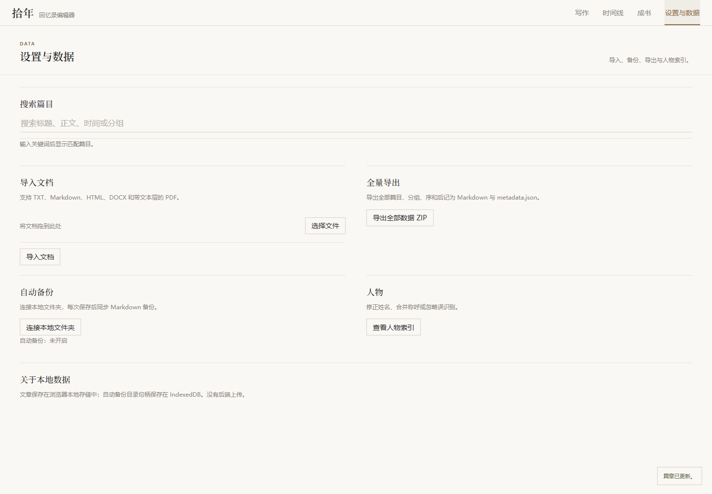

# 拾年 Shinian

一个本地优先的回忆录写作工具。写的时候不用管顺序，每篇标一个模糊的时间（「初二下学期」「2018年秋」），工具负责解析、排序、排版，最终生成一本带目录的书。

---

## 它解决什么问题

普通的时间工具只能处理精确日期。但真实回忆里的时间是这样的：

| 输入 | 含义 |
|---|---|
| `2018-09-01` | 精确日期 |
| `2018年秋` | 季节 |
| `初二下学期` | 学期，需要知道入学年份才能换算成公历 |
| `大概是初三那年冬天` | 模糊描述，带不确定性 |

这些时间**精度不同、粒度不同、甚至互相重叠**，直接按字符串或时间戳排序会出错。

拾年把模糊时间建模为 **时间区间 + 精度 + 置信度**，用一套可解释的规则处理重叠和不确定性，让「初二下学期」和「2018-09-01」能在同一条时间轴上正确排列。

---

## 界面







---

## 核心功能

- **模糊时间解析** — 支持六类时间精度：精确日期、月份、季节、学期、年份、模糊描述
- **区间排序** — 两个时间重叠时，按精度、置信度、起始时间依次比较，规则明确可解释
- **写作界面** — 标题、时间、正文，即时预览解析结果
- **时间线视图** — 所有篇目按时间排序，支持手动拖拽调整
- **成书** — 选篇目、分章节、生成目录、排版、导出 PDF / EPUB
- **导入** — 支持上传已有的 Word、Markdown、txt 文档
- **标题生成** — 无标题的文章，参考已有篇目的风格自动生成
- **人物索引** — 自动扫描正文中反复出现的人名，建立索引
- **本地优先** — 数据存在本地，不经过任何服务器

---

## 技术栈

- **TypeScript**（严格模式）
- **Vite** + **原生 TypeScript**（前端，无框架）
- **Tauri v2** + **Rust**（桌面打包，产出 `.msi` 和 `.exe` 安装包）
- **vitest**（单元测试）

---

## 技术亮点

### 1. 模糊时间建模

时间不是存成单个字符串，而是结构化的区间：

```ts
interface FuzzyTime {
  start: number;      // 最早可能的时间点（毫秒时间戳）
  end: number;        // 最晚可能的时间点
  precision: Precision; // day / month / season / semester / year / fuzzy
  original: string;   // 用户原始输入，用于显示
  confidence: number; // 0-1，表达不确定性
}
```

「2018年秋」不是一个点，是 9 月到 11 月这段区间。用区间表示，才能处理两个时间重叠的情况。

### 2. 可解释的排序规则

`compareFuzzyTime(a, b)` 按以下顺序判断：

1. 区间不重叠 → 按时间先后
2. 重叠 → 精度高的排前（`day > month > season > semester > year > fuzzy`）
3. 精度相同 → 置信度高的排前
4. 仍相同 → 按起始时间

规则明确，可测试，30+ 单元测试覆盖边界情况。

### 3. 本地优先架构

- 不依赖任何后端
- 应用以 Tauri 打包，Windows 上产出 `.msi` 和 `.exe` 两种安装包
- 数据存在本地，用户永远能带走

---

## 项目结构

```
src/
  time/           # 模糊时间解析与排序（核心模块）
    parse-time.ts
    sort-memories.ts
    types.ts
  book/           # 成书：选篇、目录、排版、导出
  documents/      # 文档导入与标题生成
  people/         # 人物索引
  speech/         # 语音输入
  storage/        # 数据存储、备份、导出
src-tauri/        # Tauri 桌面端（Rust）
tests/            # 单元测试
docs/             # 设计文档
```

---

## 快速开始

### 环境要求

- Node.js >= 22.12
- pnpm
- Rust（仅桌面端需要）

### 开发

```bash
pnpm install

# 浏览器开发
pnpm dev

# 桌面开发
pnpm tauri dev

# 运行测试
pnpm test

# 打包桌面应用
pnpm tauri build
```

打包成功后，安装包在：

```
src-tauri/target/release/bundle/msi/
src-tauri/target/release/bundle/nsis/
```

---

## 设计取舍

**为什么用区间而不是时间点？**
「2018年秋」不是一天，是一段。用区间才能处理重叠排序。

**为什么精度要参与排序？**
「2018-09-01」比「2018年」更确定，排序时应优先。

**为什么保留原始输入？**
显示给用户的是「初二下学期」，不是时间戳。结构化数据用于排序，原文用于展示。

**为什么本地优先？**
回忆是私密的。数据存在本地，用户永远能带走。

---

## 开发状态

- [x] 模糊时间解析与排序
- [x] 写作界面
- [x] 时间线视图
- [x] 成书与 PDF 导出
- [x] 文档导入
- [x] 标题生成
- [x] 人物索引
- [x] Tauri 桌面打包
- [ ] 数据存储迁移到独立 Markdown 文件（当前使用 WebView2 本地存储）

---

## License

MIT